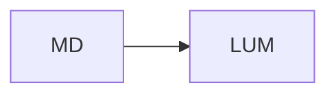

# Введение

Перейдите к [деталям](#детали) или откройте
[официальный сайт](https://example.com/).

## Детали

- [x] Импортировать Markdown
- [ ] Добавить книгу `lum`

| Формат | Статус |
| --- | --- |
| Markdown | ready |

```rust
fn main() {
    println!("Lumi");
}
```


